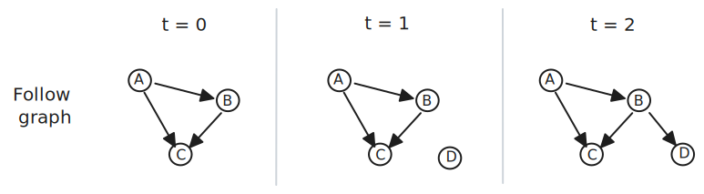
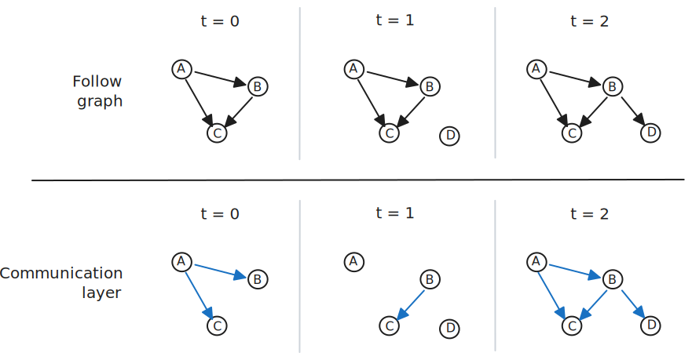

# How bsky-net works

The goal here is to more accurately model the _flow of information_ through a social network, in the hopes of improving the simulation and validation of belief dynamics models. This approach improves upon current validation techniques by:

- Explicitly separating actual and perceived beliefs of others
- Grounding belief updates in real events, unlike many belief dynamics simulations with arbitrary time steps
- Real opinion values

`bsky-net` uses a newly-available, complete record of the interactions (likes, posts, reposts, follows, blocks, etc) within the Bluesky social network since its inception in Nov. 2022.

## Structure

> This is a simplified walkthrough to illustrate how the benchmark functions in an optimal scenario. There are several caveats and open questions, which I mention at the end.

The graph is structured as a temporal network, grouped by time steps that aggregate user activity over specific intervals (e.g., hourly, daily, weekly, monthly, etc.). Within each time step, all user activities—such as posts, likes, follows, and other interactions—are collected and processed together.

The example below uses an agnostic time unit ($t=0$, $t=1$, $t=2$, etc.) to illustrate the concepts, but this can be adapted to any chosen interval in practice.

### Social network

Let's start with a basic follow graph. Per usual, each node in the graph represents a user on the network. Directed arrows represent follows; eg, at time $t=0$, User A is followed by User C. The graph is temporal, so both nodes and edges update over time; eg, User D joined the network at time $t=1$ and followed User B at time $t=2$:

To more precisely model the actual flow of information through the network, we can add an additional "communication layer" to the network that uses post creation data. For example, take the data point:

- At time $t=0$, User A created a post

Updating the graph from above based on this information, we get:

This additional information reveals the actual flow of information through the network: at time $t=0$, despite other connections in the follow graph, the only communication occurs from User A to its followers, Users B and C.

Continuing with this example, let's say:

- At time $t=1$, User B creates a post
- At time $t=2$, both Users A and B create posts

At $t=1$, information flows from User B to its lone follower, User C. At $t=2$, information flows from User A to Users B and C and from User B to User C; now that User D is a follower of User B (per the follow graph), information _also_ flows from User B to User D.

The communication layer for each timestamp is constructed dynamically, based on both the follow graph and the post activity during that specific timestamp.

### Individual beliefs

Each node's belief state can be represented by continuous or discrete values, on any scale. Assuming a discrete scale of $\{-1, 1\}$ for this example, the internal beliefs of each user at every point in time can be added to the follow graph from above:

_Note: The Bluesky dataset doesn't inherently contain interal belief measurements, but we'll discuss that in [Belief inference](#belief-inference). For now, consider these measurements as given._

At $t=0$, Users A and B hold a belief state of $+1$ and User C holds a belief state of $-1$, and so on for the other timestamps.

In the spirit of more accurately modeling the flow of information, the internal belief(s) of a user _do not directly influence the beliefs of their followers_. Rather, the beliefs _expressed by their posts_ are the sources of influence during a given timestamp.

At time $t=0$, User A holds an internal belief state of $+1$ and creates a post expressing the same belief. If the belief, for example, represents macOS ($+1$) vs. Linux ($-1$), imagine that User A's post endorses macOS. This $+1$ influence is exerted on followers B and C. Although C also follows B, B exerts no influence as they didn't post during this timestamp.

At time $t=1$, imagine that User B, a long-time macOS supporter with internal belief state $+1$, creates a post complaining about the deprecation of a beloved feature in macOS Sonoma. Despite User B's internal belief state of $+1$, this post exerts an anti-macOS influence of $-1$ on its follower, User C.

At time $t=2$, User A creates two posts, both expressing a $+1$ belief state, influencing Users B and C. User B also creates a post, influencing Users C and D.

[TODO: The dynamics of belief updating can be tied to real interactions instead of relying on things like Poisson distributions. Belief updating models are grounded to real periods of time.]

## Validation

Using the ground-truth internal belief states mentioned above, we can measure the accuracy of a proposed dynamics model at each timestamp.

For example, let's simulate a basic majority model on our graph. At time $t=0$, Users B and C experience influence from User A's post. Per the majority decision rule, Users B and C will adopt the belief state expressed in the majority of posts they receive, and so on for the subsequent timestamps:

At each timestamp, we can compare our majority model's predicted belief states against the ground-truth internal belief states from the follow graph. Various metrics could be used for this comparison, like accuracy, mean squared error, AUC, etc.

Regardless of the specific metric chosen, the goal is to quantitatively assess how well our model predicts the true belief states over time. By applying the same metric(s) to different belief dynamics models, we can evaluate and compare their performance.

## Belief inference

As mentioned in [Individual beliefs](#individual-beliefs), the Bluesky dataset doesn't inherently describe internal belief measurements nor the belief values expressed in posts. This is by far the biggest risk to this whole idea.

However, it's plausible that the dataset contains enough information to infer both internal belief states and expressed opinions. This section is very much a work in progress; I've added some thoughts below:

### Internal belief states

The complete activity data on a user (what they post, which posts they like, users they block, etc.) _might_ make it possible to infer their internal belief states. Importantly, we don't need belief measurements for all users at all times; instead, having accurate belief "checkpoints" for a subset of the graph across some time steps could still allow for meaningful [validation](#validation).

In an optimal (but uncommon) scenario, we might encounter a user who consistently posts and likes content supporting environmental conservation, frequently blocks users who deny climate change, and regularly shares scientific articles about global warming. This clear pattern of behavior could allow us to infer with high confidence that the user has a strong pro-environment internal belief state. However, such unambiguous cases are rare, and most users would likely be much more nuanced and challenging to interpret.

### Expressed beliefs

Inferring the beliefs expressed in posts is more tractable than inferring internal belief states, but still nontrivial. This task requires both identifying the topic of the post ("is this post related to environmental conservation?") and classifying the support of that post for that belief ("does this post support or oppose environmental conservation?").

For example, a post stating "We need to act now to reduce carbon emissions" would be classified as related to environmental conservation and expressing support for it. Conversely, a post saying "Climate change is a hoax" would be classified as related to environmental conservation but expressing opposition to it.

There's a very large amount of literature on this sort of thing (topic modeling, opinion mining, sentiment analysis, etc.). Large language models could be particularly useful for this task.

## Limitations and risks

Beyond the challenges discussed in [Belief inference](#belief-inference), there are several other limitations and risks to this approach. Here's my running list:

- Almost-completeness: when reconstructing the Bluesky network's history, we
  can't recover deleted records/accounts.
  - If User A followed User B on Feb. 10th and unfollowed them on Feb 15th, our dataset would show no connection between them at any point in time.
  - If a user deletes their account, we would have no record of their account nor their activity on Bluesky.
  - Real-time monitoring of the network's [_firehose_](https://docs.bsky.app/docs/advanced-guides/firehose) can log record/account deletions, but retroactive processing is unreliable.
- Source of posts: not all posts come from accounts you follow
- Selection bias: the Bluesky user base may not be representative of the general population.
- No impression data: the
- How do you handle irregular browsing behaviors? eg a user viewing a post outside of the timestamp during which it was posted, stalking a profile, etc.
